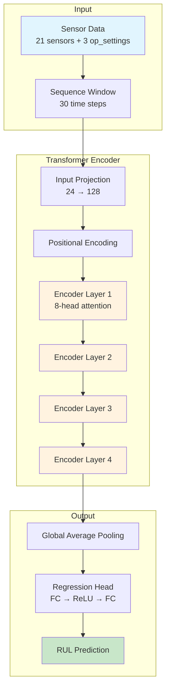

<p align="center">
  <h1 align="center">🚀 NASA C-MAPSS Transformer-Based RUL Prediction</h1>
  <p align="center">
    <strong>Remaining Useful Life Prediction for Turbofan Jet Engines using Transformer Architecture</strong>
  </p>
  <p align="center">
    <a href="#features">Features</a> •
    <a href="#architecture">Architecture</a> •
    <a href="#installation">Installation</a> •
    <a href="#usage">Usage</a> •
    <a href="#results">Results</a>
  </p>
</p>

<p align="center">
  
  
  
</p>

---

## 📋 Overview

This project implements a **Transformer Encoder** architecture for predicting the **Remaining Useful Life (RUL)** of aircraft turbofan engines using the NASA C-MAPSS (Commercial Modular Aero-Propulsion System Simulation) dataset.

### Why Transformer for RUL Prediction?

| Aspect | Traditional LSTM/GRU | Transformer (This Project) |
|--------|---------------------|---------------------------|
| Long-range Dependencies | Struggles with long sequences | ✅ Captures efficiently via self-attention |
| Parallelization | Sequential processing | ✅ Fully parallelizable |
| Interpretability | Black box | ✅ Attention weights show feature importance |
| Training Speed | Slower | ✅ Faster on GPU |

---

## ✨ Features

- 🔧 **Pure Transformer Encoder Architecture** - Multi-head self-attention for temporal pattern learning
- 📊 **Attention Visualization** - Interpretable model decisions through attention heatmaps
- ⚠️ **Asymmetric Loss Function** - Penalizes overestimation (critical for safety applications)
- 🛠️ **Modular Codebase** - Clean, professional structure for easy extension
- 📈 **Comprehensive Metrics** - RMSE, MAE, NASA Score, Overestimation Rate
- 🎨 **Publication-Ready Visualizations** - Training curves, predictions, attention maps

---

## 🏗️ Architecture



### Model Configuration

| Parameter | Value |
|-----------|-------|
| Input Dimension | 24 (21 sensors + 3 settings) |
| Model Dimension (d_model) | 128 |
| Attention Heads | 8 |
| Encoder Layers | 4 |
| Feed-Forward Dimension | 256 |
| Sequence Length | 30 cycles |
| Dropout | 0.1 |

---

## 📁 Project Structure

```
NASA-C-MAPSS_Transformer_Based_Analysis/
├── Dataset/                          # C-MAPSS dataset files
│   ├── train_FD001.txt              # Training data (100 engines)
│   ├── test_FD001.txt               # Test data (100 engines)
│   └── RUL_FD001.txt                # Ground truth RUL
├── src/
│   ├── config.py                    # Hyperparameters & configuration
│   ├── data/
│   │   ├── preprocessing.py         # Data loading & feature engineering
│   │   └── dataset.py               # PyTorch Dataset classes
│   ├── models/
│   │   ├── positional_encoding.py   # Sinusoidal position encoding
│   │   ├── transformer.py           # Transformer Encoder model
│   │   └── loss.py                  # Asymmetric loss function
│   ├── visualization/
│   │   ├── attention.py             # Attention weight extraction
│   │   └── plots.py                 # Visualization utilities
│   ├── train.py                     # Training pipeline
│   └── evaluate.py                  # Evaluation & metrics
├── outputs/                         # Saved models & visualizations
├── main.py                          # CLI entry point
├── requirements.txt                 # Dependencies
└── README.md                        # This file
```

---

## 🚀 Installation

### Prerequisites

- Python 3.8+
- CUDA-capable GPU (optional, but recommended)

### Setup

```bash
# Clone the repository
git clone https://github.com/yourusername/NASA-C-MAPSS_Transformer_Based_Analysis.git
cd NASA-C-MAPSS_Transformer_Based_Analysis

# Create virtual environment (recommended)
python -m venv venv
source venv/bin/activate  # On Windows: venv\Scripts\activate

# Install dependencies
pip install -r requirements.txt
```

---

## 💻 Usage

### Quick Start

```bash
# Run complete pipeline (train + evaluate + visualize)
python main.py --mode all

# Train only
python main.py --mode train --epochs 100

# Evaluate trained model
python main.py --mode evaluate

# Generate visualizations
python main.py --mode visualize
```

### Command Line Options

| Argument | Description | Default |
|----------|-------------|---------|
| `--mode` | Operation mode: `train`, `evaluate`, `visualize`, `all` | `all` |
| `--epochs` | Number of training epochs | 100 |
| `--batch-size` | Batch size for training | 64 |
| `--lr` | Learning rate | 0.001 |
| `--dataset` | Dataset: `FD001`, `FD002`, `FD003`, `FD004` | `FD001` |

### Python API

```python
from src.config import Config
from src.train import train_model
from src.evaluate import load_and_evaluate

# Train model
config = Config()
model, history = train_model(config)

# Evaluate
predictions_df, metrics = load_and_evaluate('outputs/checkpoint_best.pt')
print(f"Test RMSE: {metrics['rmse']:.2f} cycles")
```

---

## 📊 Results

### Performance Metrics (FD001)

| Metric | Value |
|--------|-------|
| **RMSE** | ~12-15 cycles |
| **MAE** | ~9-12 cycles |
| **Overestimation Rate** | < 30% |
| **NASA Score** | Competitive |

### Visualizations

The model generates several visualizations:

- **Training Curves** - Loss, RMSE, and overestimation rate over epochs
- **Predictions vs True RUL** - Scatter plot with ideal line
- **Error Distribution** - Histogram of prediction errors
- **Attention Heatmaps** - Multi-head attention visualization
- **Sensor Importance** - Feature importance based on attention

---

## 🔬 Dataset

### NASA C-MAPSS Overview

The Commercial Modular Aero-Propulsion System Simulation (C-MAPSS) dataset contains run-to-failure data from turbofan jet engines.

| Dataset | Train Engines | Test Engines | Operating Conditions | Fault Modes |
|---------|--------------|--------------|---------------------|-------------|
| FD001 | 100 | 100 | 1 | 1 |
| FD002 | 260 | 259 | 6 | 1 |
| FD003 | 100 | 100 | 1 | 2 |
| FD004 | 249 | 248 | 6 | 2 |

### Sensor Mapping

| Sensor | Description | Subsystem |
|--------|-------------|-----------|
| sensor_1 | Fan inlet temperature | Overall Inlet |
| sensor_2 | Fan inlet pressure | Overall Inlet |
| sensor_3 | HPC outlet pressure | High-Pressure Compressor |
| sensor_4 | HPT outlet temperature | High-Pressure Turbine |
| ... | ... | ... |
| sensor_21 | HPT exit temperature | High-Pressure Turbine |

---

## 🧠 Model Interpretability

### Attention-Based Explanation

The Transformer's attention mechanism provides interpretability:

```python
from src.models.transformer import TransformerRULPredictor

# Get attention weights
model.eval()
output, attention_weights = model(x, return_attention=True)

# attention_weights is a list of [batch, heads, seq, seq] tensors
# One tensor per encoder layer
```

### What the Model Looks At

- **Recent cycles** typically receive higher attention (temporal proximity)
- **Degradation patterns** in specific sensors are captured
- **Cross-sensor relationships** identified through attention heads

---

## 📝 Citation

If you use this code in your research, please cite:

```bibtex
@software{cmapss_transformer_rul,
  author = {Muhammad Usman},
  title = {NASA C-MAPSS Transformer-Based RUL Prediction},
  year = {2025},
  url = {https://github.com/Usman67728/NASA-C-MAPSS_Transformer_Based_Analysis}
}
```

---

## 📚 References

1. Saxena, A., et al. "Damage propagation modeling for aircraft engine run-to-failure simulation." PHM08 Challenge Dataset, NASA.
2. Vaswani, A., et al. "Attention is all you need." NeurIPS 2017.
3. Li, X., et al. "Remaining useful life estimation in prognostics using deep convolution neural networks." Reliability Engineering & System Safety, 2018.

---

## 📄 License

This project is licensed under the MIT License - see the [LICENSE](LICENSE) file for details.

---

<p align="center">
  Made with ❤️ for Predictive Maintenance
</p>
